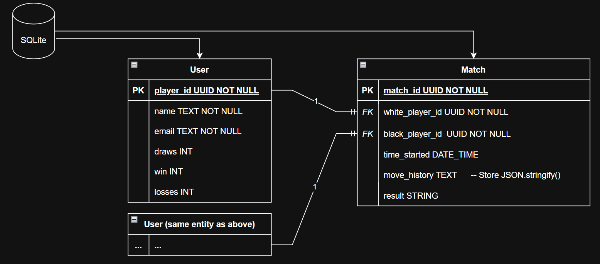

## Chyess (v0.1)

Welcome to Chyess — a modern chess platform built for playing against friends and foes alike.
#
Sharpen your skills against a clever bot or challenge a real opponent in a private room, Chyess makes it easy. 
No need to leave the house or make small talk!
#
### Why choose Chyess?

Chyess combines sleek modern design, ergonomic, and responsive experience in an environment fit for grandmasters. From clean board visuals to seamless navigation, everything is built to keep you focused on your next move.

With private rooms and fast, reliable performance, you can play with peace of mind, and keep your focus on checkmate!

Best of all? No sign-up hassles. Just log in with your Google account and you're ready to play. Quick, easy, and secure!
#
### New to chess?

No worries. Chyess provides a FREE, easy to learn, tutorial on how to begin. 
#
#### Anyone can play chess. So say yes, to Chyess!

#
## Contributors:
`Lead Developer`: Stiviyan Dragiev

`Lead Engineer`: Stiviyan Dragiev

`UX/UI`: Stiviyan Dragiev

#

## ERD Diagram

Below is a full layout of how this project is structured currently.

### Entity Descriptions

* `USER` Entity
  * Purpose: The User entity represents chess players in the system. It serves as the central repository for all player-related information and tracks their overall gaming statistics.
  * Attributes:
    * *player_id* (PK): A unique UUID identifier for each player, ensuring global uniqueness across the system
    * *name*: The player's display name
    * *email*: Unique email address for account identification and communication
    * *draws*: Running count of games that ended in a draw
    * *win*: Total number of games won
    * *losses*: Total number of games lost
  * Role: 
    * Acts as a reference table for player information
    * Enables tracking of player performance over time
    * Supports user authentication and profile management
    * Provides data for leaderboards and statistics

* `MATCH` Entity
  * Purpose: The Match entity records individual chess games between two players. It captures the complete details of each game, including participants, timing, move sequence, and outcome.
  * Attributes:
    * *match_id* (PK): A unique UUID identifier for each match
    * *white_player_id* (FK): References the User playing as white pieces
    * *black_player_id* (FK): References the User playing as black pieces
    * *time_started*: Timestamp when the match began
    * *move_history*: JSON-formatted string storing the complete sequence of moves (*using JSON.stringify()*)
    * *result*: Final outcome of the match (white wins, black wins, or draw)
  * Role: 
    * Creates a many-to-one relationship with User (each user can play multiple matches)
    * Maintains game history for analysis and replay
    * Enables calculation of player statistics and rankings
    * Supports features like game review, learning, and pattern analysis
    * The self-referencing relationship (two FKs to User) models the two-player nature of chess

## Business Rules

**Authentication:** Every USER must authenticate via Google Auth 2.0; `google_auth_token` is required and stored securely (hashed/encrypted).

**Unique Identity:** `email` must be unique across all users. Users will allow Chyess to store their email via Google Auth 2.0.

**Match Participants:** Every MATCH must have exactly two distinct USER entities (`player_white_id != player_black_id).

**Participation:** A USER may participate in zero or many matches (as either color).

**Move Recording:** `move_history` stores the complete sequence of board states from 1 to checkmate/resignation. Will be JSON-stringified to store within the database for easier storing. 
Statistics Derivation: `wins`/`losses`/`draws`on USER are derived attributes updated automatically when a MATCH outcome is finalized. 

**Time Tracking:** `time_started` = match creation time; `total_time_elapsed` is calculated and stored only when a match ends. 

**Outcome Requirement:** A match must have an `outcome` value before updating user statistics. If a player loses connection, the match will yield no outcome and will not be stored to either player’s track records. 

**Data Integrity:** Foreign keys (`player_white_id`, `player_black_id`) use ON DELETE RESTRICT. Users can delete their accounts and personal history, but matches will not be deleted per competitive nature of storing results. One user’s account deletion should not affect another account’s record statistics. This is known as soft deletion.

**Deletion Workflow:** When a user requests deletion:
- Set `deleted_at` = CURRENT_TIMESTAMP.
- Update `name` =  “deleted player” or “anonymous”.
- Set `email` = NULL (for privacy)
- Revoke `google_auth_token` (so they cannot log back in)

**Display Logic:** The frontend must check the `deleted_at` field.
- If `deleted_at` is NULL: Show actual `name`.
- If `deleted_at` is NOT NULL: Show “deleted player”.

**History Integrity:** All past matches remain linked to this `user_id`. Opponents can still see the match result, but the opponent's name will appear as “Deleted Player”.

**Leaderboards:** Users with `deleted_at != NULL` are excluded from active leaderboards.

#
## Database

**Current Relations:**
* `USER` (*player_id*, *name*, *email*, *draws*, *win*, *losses*)
* `MATCH` (*match_id*, *white_player_id, *black_player_id*, *time_started*, *move_history*, *result*)

**Normalization Check**:

**1NF (First Normal Form):** 
* All attributes contain atomic values 
* No repeating groups 
* Each column contains only one value 
* Each record is unique (has primary key)

**2NF (Second Normal Form):**
* Already in 1NF
* No partial dependencies 
* `USER`: Attributes depend on the entire PK (`player_id`)
* `MATCH`: Attributes depend on the entire PK (`match_id`)
* Foreign keys (`white_player_id`, `black_player_id`) are properly separated

**3NF (Third Normal Form):**
* Already in 2NF 
* No transitive dependencies 
* `USER`: _name_, _email_, _draws_, _win_, _losses_ all depend directly on `player_id`
* `MATCH`: `white_player_id`, `black_player_id`, `time_started`, `move_history`, result all depend directly on `match_id`

